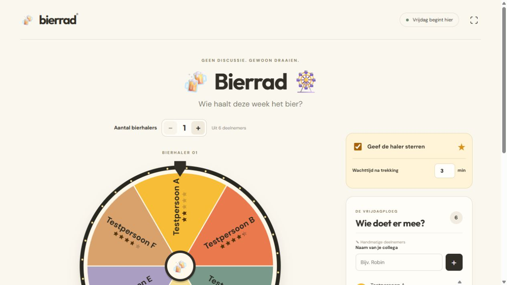
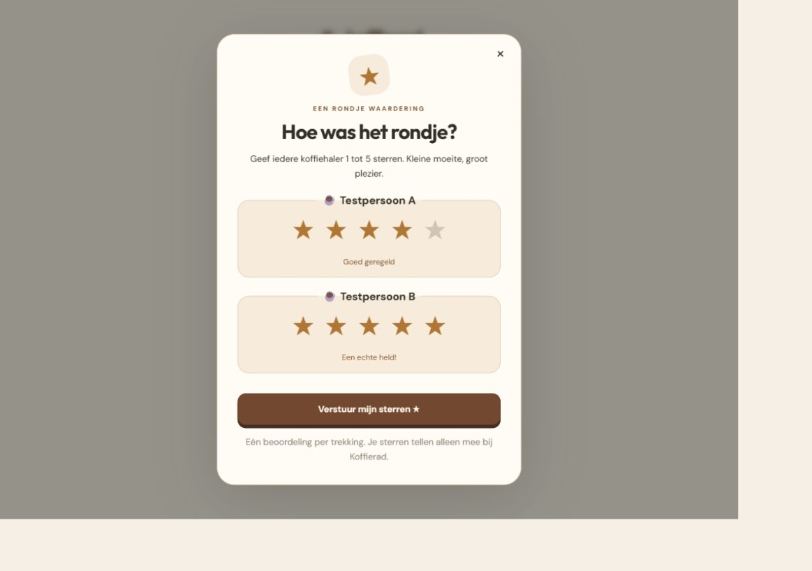
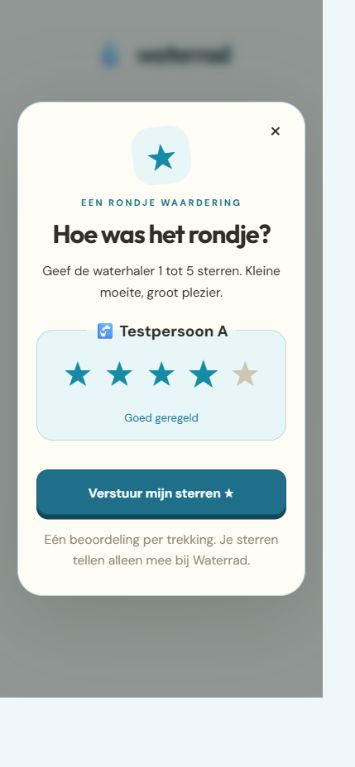

# Beoordelingen: implementatie- en visuele review

Datum: 2026-10-05. Alle schermen en tests gebruiken synthetische deelnemers; er zijn geen productiegegevens of echte Slack-inloggegevens gebruikt.

## Veiligheid en opslag

De expliciet aangevraagde privacy-uitzondering staat in [SECURITY.md](../SECURITY.md#persistent-ratings--reviewed-exception-2026-10-05). Het blijvende model bevat alleen Slack-ID, scoretotaal, aantal en gemiddelde per workspace/radtype. Geen namen of individuele stemmen in het blijvende model. Tijdelijke officiële winnaars, stemgerechtigden en stemgrants blijven bij hun sessie en verdwijnen bij afloop/beëindiging. De onomkeerbare, met de private sessie-ID opgebouwde stemclaims blijven uiterlijk tot de vaste Slack-toegangsdeadline staan; zo kan later verlengen geen tweede stem vrijgeven.

| Controle | Resultaat |
| --- | --- |
| 120 unieke stemmen, ieder driemaal tegelijk aangeboden | Precies 120 verhogingen; gemiddelde 3,0 |
| Eén formulier met meerdere winnaars | Unieke stemclaim en alle scoreverhogingen in één SQLite-transactie |
| Andere browser / nieuwe Slack-login | Nieuwe grant, dezelfde stemclaim; geen tweede beoordeling |
| Timing / sessie-expiry / revocatie | Servercontrole op elke toegang; te vroeg en verlopen geweigerd |
| Onbekende winnaar / dubbele winnaar / score buiten 1–5 | Geweigerd; geen gedeeltelijke opslag |
| Vreemde workspace / niet meegedaan | Geen stemgrant |
| Bier / koffie / water / andere workspace | Afzonderlijke scoretotalen |
| Reset of nieuwe deelnemerslijst | Eerder vastgelegde trekking blijft beoordeelbaar |
| Kanaalinstellingen | Alleen beheerder wijzigt standaard; aanvraag kan de keuze per ronde overschrijven |
| Frontend / publieke API | Alleen tijdelijke deelnemers-ID’s met gemiddelde en aantal; geen Slack-ID’s, profielen, hashes of stemgerechtigden |

Er zijn geen projectdependencies toegevoegd. Backendpublicatie vereist binding `RATINGS` en SQLite-migratie `v3`; deploy de backend vóór het frontend. Er is geen nieuwe Slack-scope of secret nodig. De checks gebruiken de echte lokale workerd/SQLite-runtime, met synthetische Slack-responses. Echte Slack-login en Cloudflare-productie zijn niet gepubliceerd of live getest.

## Visuele evaluatie

Gecontroleerd in de ingebouwde browser, op desktop en een smal scherm (ongeveer 355 CSS-pixels), met de werkelijke React-componenten en lokale synthetische previewdata. Dit controleert de presentatie en bediening; de backend wordt afzonderlijk door integratietests gecontroleerd.

| Vorm | Bevinding |
| --- | --- |
| Bier, instellingen aan / uit | Warm gele kaart; uit verbergt wachttijd en sterren |
| Compacte beoordelingsinstellingen | Alleen schakelaar en wachttijd; 20 pixels afstand tot het deelnemersvak op desktop en mobiel, zonder horizontale overloop |
| Koffie, twee winnaars | Afzonderlijke sterrenkeuze per haler; versturen pas na alle keuzes |
| Water, één winnaar op mobiel | Aqua kleuren, vijf aanraakbare keuzes; geen horizontale pagina-overloop |
| Gemiddelden 1,8 / 4,3 / 5,0 / geen beoordelingen | Werkelijk gedeeltelijk ingekleurde SVG-sterren; Nederlandse getallen en aantallen in de lijst |
| Eén / twee / vier raderen | Sterren volgen het rad; naam en sterren worden samen omgedraaid voor de leesrichting |
| Zes / twaalf / honderd deelnemers | Naam- en sterhoogte passen zich aan de segmentruimte aan; bij honderd deelnemers zijn details op het rad zeer klein. De lijst blijft de leesbare plek voor exacte scores |
| Winnaarpillen | Contrast van sterren en aantallen verhoogd ten opzichte van de eerste evaluatie |
| Pop-up na wachttijd | Sluiten en later openen mogelijk; Slack-bevestiging voorafgaand aan de sterrenkeuze |
| Succes na versturen | Formulier verdwijnt en een bedankbericht bevestigt de gebruikte stem |
| Kanaalronde aanvragen / standaard beheren | De keuze staat bij de aanvraag; afzonderlijke beheerdersinstelling voor de standaard |

De dialog gebruikt native modal focusbeheer en Escape; de sterren zijn gelabelde radioknoppen. De weergave heeft reduced-motion ondersteuning. De kantoor-tv kan de uitnodiging sluiten; alleen een geverifieerde deelnemer kan werkelijk stemmen.

### Bier: rad met gemiddelden

### Koffie: twee halers beoordelen

### Water: mobiele beoordeling

